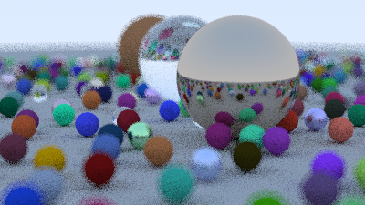

# Raytracer

- [Raytracer](#raytracer)
  - [About](#about)
  - [Setup](#setup)
  - [Future plans](#future-plans)
  - [Sample images](#sample-images)
    - [Simple scene](#simple-scene)
      - [*10 samples per pixel*](#10-samples-per-pixel)
      - [*100 samples per pixel*](#100-samples-per-pixel)
      - [*100 samples per pixel with defocus blur*](#100-samples-per-pixel-with-defocus-blur)
    - [Textbook scene](#textbook-scene)
      - [*10 samples per pixel*](#10-samples-per-pixel-1)

## About
This project is from [_Ray Tracing in One Weekend_](https://raytracing.github.io/books/RayTracingInOneWeekend.html) by Peter Shirley, Trevor David Black, Steve Hollasch.

## Setup
To use and render some scenes
1. clone the project to your machine
2. run `make`
3. You will be prompted on which scene you want to render

    
4. Input the corresponding option.
4. And your image is created in `.ppm` fomat as `image.ppm`

## Future plans
- [ ] Hardware acceleration
- [ ] Dynamic scenes
- [ ] Interactivity
- [ ] Emitters
- [ ] Lasers
- [ ] Volumetric smoke
- [ ] Diffraction

## Sample images

### Simple scene 

#### *10 samples per pixel*

#### *100 samples per pixel*

#### *100 samples per pixel with defocus blur*

### Textbook scene 

#### *10 samples per pixel*

The image is of quite low resolution as it takes too long to run.
To be updated with higher resolution version once hardware acceleration is implemented
